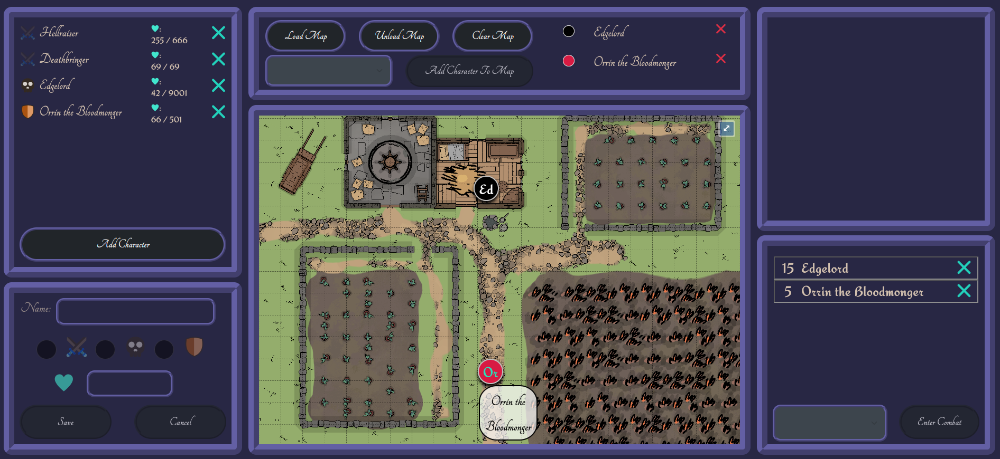

# DnD_HUD

This is but a wee program that is supposed to help keep some of the more tedious things a DM has to keep track of a bit in order. There is not really much else to say about it, methinks.

Character list
: a list of characters in the current scene (PC :crossed_swords:, NPC :shield:, and monster/bad guy :skull:)
clicking "Add Character" enables the below box to add another char

Map stuff
: the big center box shows the currently loaded map
"Load Map" opens a window to select any local image file as a map
"Unload Map" clears the map and results in a blank screen (the usefulness of this function remains debated amongst scholars to this day)
"Clear Map" removes all characters from the map

Combat order
: the bottom right box lists all characters currently set to be in combat in order of their initiative

## Planned features

1. a list of monster/NPC stat blocks in the top right box
2. make it a desktop app using Electron
3. saving the current state of the session and loading it again later
4. maaaaybe a little something to show and write session notes, planned encounters, etc. and save them with the session
5. like, an actual name for the whole thing

## README of the Vue.js template

This template should help get you started developing with Vue 3 in Vite. The template uses Vue 3 `<script setup>` SFCs, check out the [script setup docs](https://v3.vuejs.org/api/sfc-script-setup.html#sfc-script-setup) to learn more.

### Setup

1. Clone the project
2. `npm install`
3. `npm run download:pyodide`
4. `npm run dev`

### Tooling

I recommend using [Visual Studio Code](https://code.visualstudio.com/) with

- [Prettier Extension](https://marketplace.visualstudio.com/items?itemName=esbenp.prettier-vscode) to format your files
- Settings &rarr; Format On Save &rarr; Enable (`"editor.formatOnSave": true,`)
- [Volar](https://marketplace.visualstudio.com/items?itemName=johnsoncodehk.volar) for Vue.js
- [(optional)npm Extension](https://marketplace.visualstudio.com/items?itemName=eg2.vscode-npm-script)
- [(optional)TODO Highlight Extension](https://marketplace.visualstudio.com/items?itemName=wayou.vscode-todo-highlight)
